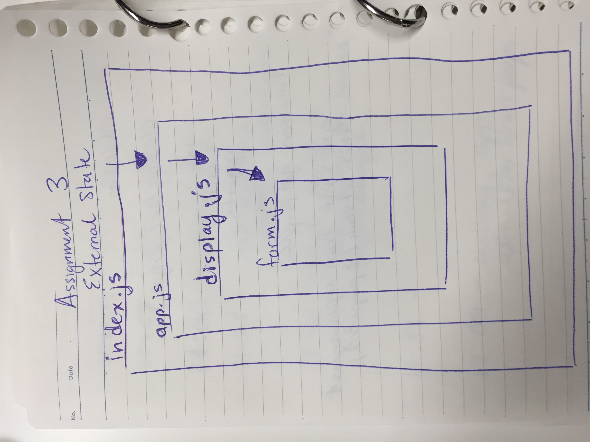

## Props and State 01.30.19

[Repo](https://github.com/hingham/react-hi)

Assignments: Props and State

#### Modules: Modules for 1, 2, and 3
##### Assignment 1
* app.js
* counter.js
##### Assignment 2
* app.js
* counter.js

##### Assignment 3
* app.js
* display.js
* form.js

[assignments 1: code-props-1](https://kopkymzyl7.codesandbox.io/)
[assignments 2: sandbox](https://codesandbox.io/s/kopkymzyl7)

[assignments 2: internal-state-1](https://20xl0l6kvp.codesandbox.io/)
[assignments 2: sandbox](https://codesandbox.io/s/20xl0l6kvp)

[assignments 2: internal-state-2](https://j77ywz6kj3.codesandbox.io/)
[assignment 2: box](https://codesandbox.io/s/20xl0l6kvp)

[assingment 3: external-state-1](https://64p9plr75r.codesandbox.io/)
[assignment 3: sandbox](https://codesandbox.io/s/64p9plr75r)

### Description:
Practice writing functions to change state on the submission on the form, and the change of input. Once you have created the form and the event handler, modularize the functions into different files. 
Using props:

When you require in a component, give it the props that reference the corresponding properties of state you are using in the component. 

